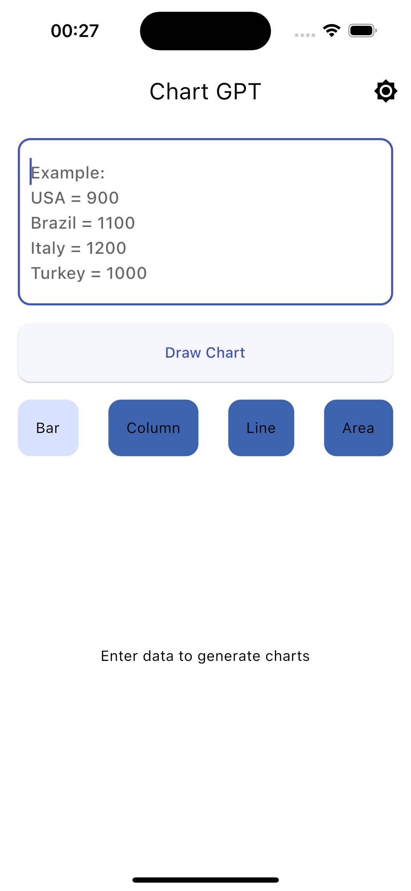

# Chart GPT

Simple app that draws bar, column, line and area charts with the help of OpenAI API

## Preview

<p align='center'>
    
    
    
    
</p>

## Getting Started

Follow these steps to run the project:

1. Clone the repository:

```
git clone https://github.com/cem256/chart_gpt.git
```

2. Obtain an API key from [OpenAI API](https://openai.com/blog/openai-api).

3. Create a `.env` file in the `env` folder located at the root of the project, and add your API key:

```
BEARER = 'YOUR_API_KEY_GOES_HERE'
```

4. Execute the following command in your project's root folder to generate required files:

```sh
flutter pub run build_runner build --delete-conflicting-outputs

```

And you are good to go. Run your project as you usually do.
